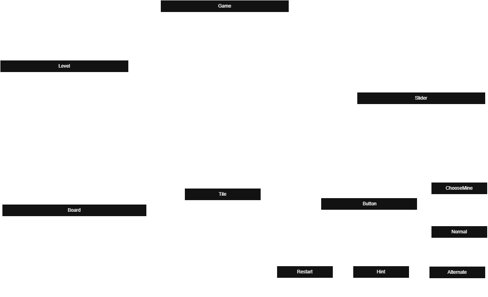

# Technical Details:

Period 3
Owen Zeng, Steven Wu
Minesweepers (placeholder)

First we will create basic Minesweeper (based on [Google Doodle Minesweeper](https://www.google.com/fbx?fbx=minesweeper)specifically). We will implement level generation with mines and mechanics of clearing the board. If that is too easy to implement (because we are finished early), we will then add "variants", or modes, taken from the game [14 Minesweeper Variants](https://store.steampowered.com/app/1865060/14_Minesweeper_Variants/). These variants can change the rules of generation and playing the game. The steam game also implements a bunch of side features, such as hints, in-game drawing tools, and level/difficulty selection.

MVP: We will have created basic Minesweeper. It will have features such as:
Selection of difficulty (~board size~ & mine count)
Generation of valid board/Mine layout
Revealing and Flagging of tiles, Check for ~win~/loss

Nice to have features: 
Different modes/variations that change up the rules for mines/clearing. (Update: Only one mode added - misleading mine counts)
~Example: Guessing mode, where the there will be sections where you are forced to guess.~ 
Explanation: Our generation does not generate a No-Guess board. In order to generate one, we would have to make our own Minesweeper solver and only allow boards that the solver could solve. 

~In-game drawing tools (writing on the screen)~ 
Explanation: Not enough time
Menu/Level layout: 
    Skip & Retry level
    Hints (updated: flags an unflagged mine)

A description of your technical design. This should include: 
   
How you will be using the topics covered in class in the project.
     
# Project Design
Old Diagram:

Final Diagram:

# Intended pacing:

(Assuming we start after wednesday)
- [ ] By Friday, finish class structure
    - [ ] Finish tile(person 1)
    - [ ] Finish Board(person 1)
    - [ ] Finish Level class(person 2)

- [ ] By Wednesday, finish the visual representations of the game and mechanics
    - [ ] Finish board drawing(person 1)
    - [ ] Finish depiction of tiles(person 1)
    - [ ] Finish actions for first click generation(person 2)
    - [ ] Finish flagging and chording, and click(person 2)
    - [ ] Finish win/lose screen (open for whoever finishes)

- [ ] By Friday, get variations working.
    - [ ] Finish drawing on the board(person 1)
    - [ ] Finish button class
    - [ ] Finish game hints(person 2)
    - [ ] Menu/Level layout with skips and retries(person 2)
